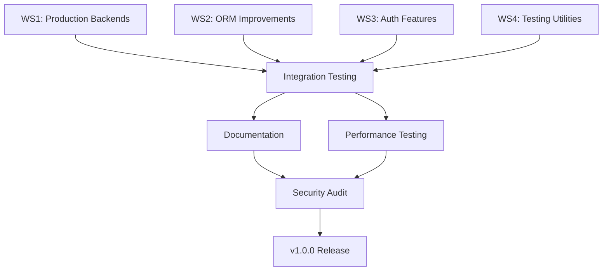

# RustForge Gap Closure Implementation Plan

**Datum:** 13. November 2025
**Basierend auf:** LARAVEL_COMPARISON_ANALYSIS.md
**Ziel:** Production-Ready Framework (v1.0.0)
**Zeitrahmen:** 8-12 Wochen (2-3 Monate)

---

## Executive Summary

### Kritische Gaps Identifiziert

Basierend auf der detaillierten Laravel-Vergleichsanalyse wurden **4 kritische Bereiche** identifiziert, die RustForge von "Beta" zu "Production-Ready" bringen:

| Priority | Gap Area | Current State | Impact | Effort |
|----------|----------|---------------|--------|--------|
| **P0** | **Production Backends** | Memory only | **BLOCKING** | 600 LOC |
| **P1** | **ORM Improvements** | 70/100 | SIGNIFICANT | 800 LOC |
| **P2** | **Auth Features** | 80/100 | MODERATE | 700 LOC |
| **P3** | **Testing Utilities** | 75/100 | MODERATE | 500 LOC |

### Current Framework Status

- **Total Crates:** 91
- **Lines of Code:** 130,416
- **Test Functions:** 230+
- **Feature Parity:** 60-65% vs Laravel
- **Production Ready:** ❌ **NO** (Queue/Cache Memory-only)

### Key Findings

#### Critical Blockers (MUST FIX)
1. **rf-queue:** Nur Memory Backend - Jobs verloren bei Restart
2. **rf-cache:** Nur Memory Backend - Kein distributed caching
3. **Production Impact:** Framework kann **NICHT** in Production verwendet werden

#### Significant Gaps
4. **rf-orm:** Keine Collections, Query Scopes, Polymorphic Relations
5. **Relationship Loading:** Nicht so elegant wie Eloquent
6. **Complex Data Models:** Schwierig zu implementieren

#### Moderate Gaps
7. **rf-auth:** Email Verification, Password Reset, Social Login fehlen
8. **rf-testing:** assertDatabaseHas, Queue::fake(), Event::fake() fehlen

---

## Workstream Architecture

Die Implementierung erfolgt in **4 parallelen Workstreams** mit minimalen Dependencies:

```
┌─────────────────────────────────────────────────────────────┐
│                   GAP CLOSURE ROADMAP                        │
├─────────────────────────────────────────────────────────────┤
│                                                               │
│  WS1: Production Backends  ← KRITISCH (P0)                   │
│  │                                                            │
│  ├─ Redis Queue Backend                                      │
│  └─ Redis Cache Backend                                      │
│                                                               │
│  WS2: ORM Improvements     ← SIGNIFIKANT (P1)                │
│  │                                                            │
│  ├─ Query Scopes                                             │
│  ├─ Collections (Laravel-style)                              │
│  └─ Polymorphic Relations                                    │
│                                                               │
│  WS3: Auth Features        ← MODERAT (P2)                    │
│  │                                                            │
│  ├─ Email Verification                                       │
│  ├─ Password Reset                                           │
│  └─ Remember Me                                              │
│                                                               │
│  WS4: Testing Utilities    ← MODERAT (P3)                    │
│  │                                                            │
│  ├─ assertDatabaseHas                                        │
│  ├─ Queue Fakes                                              │
│  └─ Event Fakes                                              │
│                                                               │
└─────────────────────────────────────────────────────────────┘
```

---

## WORKSTREAM 1: Production Backends (KRITISCH)

### 🎯 Ziel & Impact

**Ziel:** Redis-basierte Backends für Queue und Cache implementieren
**Impact:** Framework wird **production-ready** - Jobs/Cache überleben Restarts
**Priority:** **P0 - BLOCKING**
**Effort:** ~600 LOC
**Timeline:** Woche 1-2

### Warum Kritisch?

```
AKTUELL:
- Queue: Memory Backend → Jobs verloren bei Restart ❌
- Cache: Memory Backend → Single-instance only ❌

NACH IMPLEMENTIERUNG:
- Queue: Redis Backend → Persistent, distributed ✅
- Cache: Redis Backend → Distributed, persistent ✅

PRODUCTION IMPACT:
- Background Jobs funktionieren zuverlässig
- Cache funktioniert über mehrere Instanzen
- Horizontal scaling möglich
```

### Betroffene Crates

```
crates/rf-queue/
├── Cargo.toml (redis feature bereits definiert!)
├── src/
│   ├── lib.rs
│   ├── queue.rs
│   ├── memory.rs
│   └── redis.rs      ← NEU: Redis Backend Implementation

crates/rf-cache/
├── Cargo.toml (redis feature bereits definiert!)
├── src/
│   ├── lib.rs
│   └── redis.rs      ← NEU: Redis Backend Implementation
```

### Implementierungs-Tasks

#### Task 1.1: Redis Queue Backend (300 LOC)

**File:** `crates/rf-queue/src/redis.rs`

```rust
// IMPLEMENTIERUNG:
pub struct RedisQueue {
    pool: deadpool_redis::Pool,
    queue_name: String,
    retry_attempts: u32,
}

impl RedisQueue {
    // 1. Connection pooling setup
    pub async fn new(url: &str, queue_name: &str) -> QueueResult<Self>

    // 2. Redis LIST für Queue (LPUSH/BRPOP)
    async fn push_to_redis(&self, job: &JobMetadata) -> QueueResult<()>
    async fn pop_from_redis(&self) -> QueueResult<Option<JobMetadata>>

    // 3. Delayed Jobs mit Sorted Set (ZADD mit timestamp)
    async fn schedule_delayed(&self, job: &JobMetadata, delay: Duration) -> QueueResult<()>
    async fn move_delayed_to_ready(&self) -> QueueResult<()>

    // 4. Failed Jobs Queue
    async fn move_to_failed(&self, job: &JobMetadata, error: &str) -> QueueResult<()>

    // 5. Job Status Tracking
    async fn update_status(&self, job_id: &str, status: JobStatus) -> QueueResult<()>
}

#[async_trait]
impl Queue for RedisQueue {
    async fn push(&self, job: JobMetadata) -> QueueResult<()>;
    async fn pop(&self) -> QueueResult<Option<JobMetadata>>;
    async fn size(&self) -> QueueResult<usize>;
    async fn clear(&self) -> QueueResult<()>;
}
```

**Redis Data Structures:**
```
# Main Queue (List)
queue:{name}:jobs → LPUSH job_json

# Delayed Jobs (Sorted Set)
queue:{name}:delayed → ZADD timestamp job_json

# Failed Jobs (List)
queue:{name}:failed → LPUSH job_json

# Job Status (Hash)
queue:{name}:status:{job_id} → HSET field value
```

**Testing:**
```rust
#[tokio::test]
async fn test_redis_queue_persistence() {
    let queue = RedisQueue::new("redis://localhost", "test").await?;

    // Push job
    queue.push(job).await?;

    // Simulate restart (drop and recreate)
    drop(queue);
    let queue = RedisQueue::new("redis://localhost", "test").await?;

    // Job should still exist
    let popped = queue.pop().await?;
    assert!(popped.is_some());
}
```

#### Task 1.2: Redis Cache Backend (200 LOC)

**File:** `crates/rf-cache/src/redis.rs`

```rust
// IMPLEMENTIERUNG:
pub struct RedisCache {
    pool: deadpool_redis::Pool,
    prefix: String,
}

impl RedisCache {
    pub async fn new(url: &str, prefix: &str) -> CacheResult<Self>

    // 1. Basic Operations (GET, SET, DEL)
    async fn get_from_redis(&self, key: &str) -> CacheResult<Option<Vec<u8>>>
    async fn set_to_redis(&self, key: &str, value: &[u8], ttl: Duration) -> CacheResult<()>

    // 2. Cache Tags (Sets)
    async fn add_tag(&self, tag: &str, key: &str) -> CacheResult<()>
    async fn flush_tag(&self, tag: &str) -> CacheResult<()>

    // 3. Atomic Locks (SETNX + Expire)
    pub async fn lock(&self, key: &str, ttl: Duration) -> CacheResult<bool>
    pub async fn unlock(&self, key: &str) -> CacheResult<()>
}

#[async_trait]
impl Cache for RedisCache {
    async fn get<T: DeserializeOwned + Send>(&self, key: &str) -> CacheResult<Option<T>>;
    async fn set<T: Serialize + Sync>(&self, key: &str, value: &T, ttl: Duration) -> CacheResult<()>;
    async fn delete(&self, key: &str) -> CacheResult<()>;
    async fn exists(&self, key: &str) -> CacheResult<bool>;
    async fn flush(&self) -> CacheResult<()>;
}
```

**Redis Data Structures:**
```
# Cache Entries (String with TTL)
cache:{prefix}:{key} → SET value EX ttl

# Cache Tags (Set)
cache:{prefix}:tag:{tag} → SADD key1 key2 key3

# Cache Locks (String with TTL)
cache:{prefix}:lock:{key} → SETNX value EX ttl
```

**Testing:**
```rust
#[tokio::test]
async fn test_redis_cache_distributed() {
    let cache1 = RedisCache::new("redis://localhost", "app").await?;
    let cache2 = RedisCache::new("redis://localhost", "app").await?;

    // Set in cache1
    cache1.set("key", &"value", Duration::from_secs(60)).await?;

    // Get from cache2 (different instance)
    let value: Option<String> = cache2.get("key").await?;
    assert_eq!(value, Some("value".to_string()));
}
```

#### Task 1.3: Integration & Configuration (100 LOC)

**Update:** `crates/rf-queue/src/lib.rs`

```rust
// Add Redis Backend to public API
pub use redis::RedisQueue;

// Queue Factory
pub enum QueueBackend {
    Memory,
    Redis { url: String, queue_name: String },
}

impl QueueBackend {
    pub async fn create(self) -> QueueResult<Arc<dyn Queue>> {
        match self {
            QueueBackend::Memory => Ok(Arc::new(MemoryQueue::new())),
            QueueBackend::Redis { url, queue_name } => {
                Ok(Arc::new(RedisQueue::new(&url, &queue_name).await?))
            }
        }
    }
}
```

**Update:** `crates/rf-cache/src/lib.rs`

```rust
// Add Redis Backend to public API
pub use redis::RedisCache;

// Cache Factory
pub enum CacheBackend {
    Memory,
    Redis { url: String, prefix: String },
}

impl CacheBackend {
    pub async fn create(self) -> CacheResult<Arc<dyn Cache>> {
        match self {
            CacheBackend::Memory => Ok(Arc::new(MemoryCache::new())),
            CacheBackend::Redis { url, prefix } => {
                Ok(Arc::new(RedisCache::new(&url, &prefix).await?))
            }
        }
    }
}
```

### Testing Strategy

#### Unit Tests (per Task)
- Redis connection pooling
- Basic CRUD operations
- TTL expiration
- Tag operations
- Lock mechanisms

#### Integration Tests
```rust
// Test Suite: Redis Queue Integration
#[tokio::test]
async fn test_queue_persistence_after_restart()
#[tokio::test]
async fn test_delayed_jobs_execution()
#[tokio::test]
async fn test_failed_job_handling()
#[tokio::test]
async fn test_concurrent_workers()

// Test Suite: Redis Cache Integration
#[tokio::test]
async fn test_distributed_cache_consistency()
#[tokio::test]
async fn test_cache_stampede_prevention()
#[tokio::test]
async fn test_tag_based_invalidation()
```

#### Performance Tests
```rust
#[tokio::test]
async fn benchmark_queue_throughput() {
    // Target: 10,000+ jobs/sec
}

#[tokio::test]
async fn benchmark_cache_latency() {
    // Target: <1ms per operation
}
```

### Success Criteria

- [ ] Redis Queue Backend implementiert
- [ ] Redis Cache Backend implementiert
- [ ] Alle Tests grün (Unit + Integration)
- [ ] Documentation vollständig
- [ ] Performance Benchmarks erfüllt:
  - Queue: >10,000 jobs/sec
  - Cache: <1ms latency
- [ ] Production-ready: Jobs überleben Restarts
- [ ] Distributed: Cache funktioniert über mehrere Instances

### Dependencies

**None** - Dieser Workstream ist komplett unabhängig!

---

## WORKSTREAM 2: ORM Improvements (SIGNIFIKANT)

### 🎯 Ziel & Impact

**Ziel:** Laravel Eloquent-ähnliche Features für bessere DX
**Impact:** Komplexe Datenmodelle werden eleganter und einfacher
**Priority:** **P1 - SIGNIFICANT**
**Effort:** ~800 LOC
**Timeline:** Woche 2-4

### Warum Signifikant?

```
AKTUELL:
- Query Scopes: ❌ Keine Wiederverwendung
- Collections: ❌ Nur Vec/Iterator (keine Eloquent Methoden)
- Polymorphic Relations: ❌ Nicht unterstützt

PROBLEM:
// Laravel: Elegant
$users = User::active()->premium()->get();

// RustForge: Umständlich
let users = User::query(&db)
    .where_eq(user::Column::Active, true)
    .where_eq(user::Column::Premium, true)
    .get().await?;

NACH IMPLEMENTIERUNG:
let users = User::query(&db)
    .scope("active")
    .scope("premium")
    .get().await?
    .into_collection()
    .filter(|u| u.verified)
    .map(|u| u.email)
    .collect();
```

### Betroffene Crates

```
crates/rf-orm/
├── src/
│   ├── lib.rs
│   ├── query_builder.rs    ← UPDATE: Scopes hinzufügen
│   ├── relationships.rs    ← UPDATE: Polymorphic Relations
│   ├── collection.rs       ← NEU: Laravel Collection API
│   └── scopes.rs           ← NEU: Query Scopes
```

### Implementierungs-Tasks

#### Task 2.1: Query Scopes (250 LOC)

**File:** `crates/rf-orm/src/scopes.rs`

```rust
// TRAIT für Scope Definition
pub trait HasScopes: EntityTrait {
    fn scopes() -> HashMap<&'static str, ScopeFn<Self>>;
}

pub type ScopeFn<E> = Box<dyn Fn(Select<E>) -> Select<E> + Send + Sync>;

// MACRO für einfache Scope Definition
#[macro_export]
macro_rules! define_scopes {
    ($entity:ty, { $($name:literal => |$query:ident| $body:expr),* $(,)? }) => {
        impl HasScopes for $entity {
            fn scopes() -> HashMap<&'static str, ScopeFn<Self>> {
                let mut map = HashMap::new();
                $(
                    map.insert($name, Box::new(|$query: Select<Self>| $body) as ScopeFn<Self>);
                )*
                map
            }
        }
    };
}

// USAGE:
define_scopes!(User, {
    "active" => |query| query.filter(user::Column::Active.eq(true)),
    "premium" => |query| query.filter(user::Column::Premium.eq(true)),
    "verified" => |query| query.filter(user::Column::EmailVerifiedAt.is_not_null()),
});
```

**Update:** `crates/rf-orm/src/query_builder.rs`

```rust
impl<E: EntityTrait + HasScopes> QueryBuilder<E> {
    pub fn scope(mut self, name: &str) -> Self {
        if let Some(scope_fn) = E::scopes().get(name) {
            self.query = scope_fn(self.query);
        }
        self
    }

    pub fn scopes(mut self, names: &[&str]) -> Self {
        for name in names {
            self = self.scope(name);
        }
        self
    }
}
```

**Testing:**
```rust
#[tokio::test]
async fn test_query_scopes() {
    let users = User::query(&db)
        .scope("active")
        .scope("premium")
        .get().await?;

    assert!(users.iter().all(|u| u.active && u.premium));
}

#[tokio::test]
async fn test_chained_scopes() {
    let users = User::query(&db)
        .scopes(&["active", "verified"])
        .get().await?;

    assert!(users.iter().all(|u| u.active && u.email_verified_at.is_some()));
}
```

#### Task 2.2: Laravel-Style Collections (350 LOC)

**File:** `crates/rf-orm/src/collection.rs`

```rust
// Laravel Collection API für Rust
pub struct Collection<T> {
    items: Vec<T>,
}

impl<T> Collection<T> {
    pub fn new(items: Vec<T>) -> Self {
        Self { items }
    }

    // Laravel Collection Methods
    pub fn filter<F>(self, predicate: F) -> Self
    where F: FnMut(&T) -> bool {
        Self {
            items: self.items.into_iter().filter(predicate).collect(),
        }
    }

    pub fn map<U, F>(self, f: F) -> Collection<U>
    where F: FnMut(T) -> U {
        Collection {
            items: self.items.into_iter().map(f).collect(),
        }
    }

    pub fn pluck<U, F>(&self, f: F) -> Vec<U>
    where F: Fn(&T) -> U {
        self.items.iter().map(f).collect()
    }

    pub fn first(&self) -> Option<&T> {
        self.items.first()
    }

    pub fn last(&self) -> Option<&T> {
        self.items.last()
    }

    pub fn chunk(self, size: usize) -> Vec<Collection<T>> {
        self.items
            .chunks(size)
            .map(|chunk| Collection::new(chunk.to_vec()))
            .collect()
    }

    pub fn group_by<K, F>(self, f: F) -> HashMap<K, Collection<T>>
    where
        K: Eq + Hash,
        F: Fn(&T) -> K,
    {
        let mut groups: HashMap<K, Vec<T>> = HashMap::new();
        for item in self.items {
            let key = f(&item);
            groups.entry(key).or_default().push(item);
        }
        groups.into_iter()
            .map(|(k, v)| (k, Collection::new(v)))
            .collect()
    }

    pub fn unique_by<K, F>(self, f: F) -> Self
    where
        K: Eq + Hash,
        F: Fn(&T) -> K,
    {
        let mut seen = HashSet::new();
        let items = self.items.into_iter()
            .filter(|item| seen.insert(f(item)))
            .collect();
        Self { items }
    }

    pub fn sort_by<F>(mut self, compare: F) -> Self
    where F: FnMut(&T, &T) -> std::cmp::Ordering {
        self.items.sort_by(compare);
        self
    }

    pub fn take(self, n: usize) -> Self {
        Self {
            items: self.items.into_iter().take(n).collect(),
        }
    }

    pub fn skip(self, n: usize) -> Self {
        Self {
            items: self.items.into_iter().skip(n).collect(),
        }
    }

    pub fn count(&self) -> usize {
        self.items.len()
    }

    pub fn is_empty(&self) -> bool {
        self.items.is_empty()
    }

    pub fn contains<F>(&self, predicate: F) -> bool
    where F: Fn(&T) -> bool {
        self.items.iter().any(predicate)
    }

    // Convert to Vec
    pub fn to_vec(self) -> Vec<T> {
        self.items
    }
}

// Extension trait für QueryBuilder
pub trait IntoCollection {
    type Item;
    fn into_collection(self) -> Collection<Self::Item>;
}

impl<T> IntoCollection for Vec<T> {
    type Item = T;
    fn into_collection(self) -> Collection<T> {
        Collection::new(self)
    }
}
```

**Usage Example:**
```rust
// Laravel-style Collection Operations
let emails = User::query(&db)
    .scope("active")
    .get().await?
    .into_collection()
    .filter(|u| u.verified)
    .pluck(|u| &u.email)
    .collect::<Vec<_>>();

// Group by role
let by_role = User::query(&db)
    .get().await?
    .into_collection()
    .group_by(|u| &u.role);

// Unique users
let unique = User::query(&db)
    .get().await?
    .into_collection()
    .unique_by(|u| &u.email);
```

#### Task 2.3: Polymorphic Relations (200 LOC)

**File:** `crates/rf-orm/src/relationships.rs` (Update)

```rust
// Polymorphic Relation Support
pub trait Morphable: EntityTrait {
    fn morph_type() -> &'static str;
}

#[async_trait]
pub trait MorphTo<E: EntityTrait> {
    async fn morph_to<T: Morphable>(
        &self,
        db: &DatabaseConnection,
    ) -> DbResult<Option<T::Model>>;
}

#[async_trait]
pub trait MorphMany<E: EntityTrait> {
    async fn morph_many<T: Morphable>(
        &self,
        db: &DatabaseConnection,
    ) -> DbResult<Vec<T::Model>>;
}

// MACRO für Polymorphic Relations
#[macro_export]
macro_rules! morphable {
    ($entity:ty, $type:literal) => {
        impl Morphable for $entity {
            fn morph_type() -> &'static str {
                $type
            }
        }
    };
}

// USAGE:
morphable!(Post, "post");
morphable!(Video, "video");

// Comment can belong to Post or Video
impl MorphTo<Comment> for comment::Model {
    async fn morph_to<T: Morphable>(
        &self,
        db: &DatabaseConnection,
    ) -> DbResult<Option<T::Model>> {
        if self.commentable_type == T::morph_type() {
            T::find_by_id(db, self.commentable_id).await
        } else {
            Ok(None)
        }
    }
}
```

**Testing:**
```rust
#[tokio::test]
async fn test_morph_to_relation() {
    // Create post with comment
    let post = create_post(&db).await?;
    let comment = create_comment(&db, "post", post.id).await?;

    // Load polymorphic relation
    let commentable = comment.morph_to::<Post>(&db).await?;
    assert!(commentable.is_some());
}
```

### Testing Strategy

#### Unit Tests
- Query scope registration
- Scope chaining
- Collection methods (map, filter, pluck, etc.)
- Polymorphic relation loading

#### Integration Tests
```rust
#[tokio::test]
async fn test_complex_query_with_scopes()
#[tokio::test]
async fn test_collection_pipeline()
#[tokio::test]
async fn test_polymorphic_comments()
```

### Success Criteria

- [ ] Query Scopes implementiert und getestet
- [ ] Laravel Collection API (20+ Methoden)
- [ ] Polymorphic Relations funktionieren
- [ ] Documentation mit Beispielen
- [ ] Performance: Collection Ops < 1ms overhead
- [ ] DX: Code ist signifikant eleganter

### Dependencies

**None** - Unabhängig von anderen Workstreams

---

## WORKSTREAM 3: Auth Features (MODERAT)

### 🎯 Ziel & Impact

**Ziel:** Standard Auth-Flows (Email Verify, Password Reset, Remember Me)
**Impact:** Entwickler müssen Standard-Auth nicht mehr manuell bauen
**Priority:** **P2 - MODERATE**
**Effort:** ~700 LOC
**Timeline:** Woche 3-5

### Warum Moderat?

```
AKTUELL:
- Email Verification: ❌ Muss manuell gebaut werden
- Password Reset: ❌ Muss manuell gebaut werden
- Remember Me: ❌ Nicht unterstützt

PROBLEM:
Jede App braucht diese Features, aber Entwickler müssen sie
jedes Mal von Grund auf neu implementieren.

NACH IMPLEMENTIERUNG:
// Email Verification
user.send_verification_email(&mailer).await?;
user.verify_email(&token).await?;

// Password Reset
user.send_password_reset(&mailer).await?;
user.reset_password(&token, &new_password).await?;

// Remember Me
auth.login_with_remember(&user, true).await?;
```

### Betroffene Crates

```
crates/rf-auth/
├── src/
│   ├── lib.rs
│   ├── verification/        ← NEU: Email Verification
│   │   ├── mod.rs
│   │   ├── token.rs
│   │   └── middleware.rs
│   ├── password_reset/      ← NEU: Password Reset
│   │   ├── mod.rs
│   │   └── token.rs
│   └── remember_me/         ← NEU: Remember Me
│       ├── mod.rs
│       └── cookie.rs
```

### Implementierungs-Tasks

#### Task 3.1: Email Verification (250 LOC)

**File:** `crates/rf-auth/src/verification/mod.rs`

```rust
// Email Verification System
pub struct EmailVerification {
    secret: String,
    ttl: Duration,
}

impl EmailVerification {
    pub fn new(secret: String, ttl: Duration) -> Self {
        Self { secret, ttl }
    }

    // Generate signed verification token
    pub fn generate_token(&self, user_id: i64, email: &str) -> AuthResult<String> {
        let claims = VerificationClaims {
            sub: user_id,
            email: email.to_string(),
            exp: (Utc::now() + self.ttl).timestamp() as usize,
        };

        encode(
            &Header::default(),
            &claims,
            &EncodingKey::from_secret(self.secret.as_bytes()),
        )
        .map_err(|e| AuthError::TokenGeneration(e.to_string()))
    }

    // Verify token and return user_id
    pub fn verify_token(&self, token: &str) -> AuthResult<VerificationClaims> {
        decode::<VerificationClaims>(
            token,
            &DecodingKey::from_secret(self.secret.as_bytes()),
            &Validation::default(),
        )
        .map(|data| data.claims)
        .map_err(|e| AuthError::InvalidToken(e.to_string()))
    }

    // Generate verification URL
    pub fn generate_url(&self, base_url: &str, user_id: i64, email: &str) -> AuthResult<String> {
        let token = self.generate_token(user_id, email)?;
        Ok(format!("{}/verify-email?token={}", base_url, token))
    }
}

#[derive(Debug, Serialize, Deserialize)]
pub struct VerificationClaims {
    pub sub: i64,
    pub email: String,
    pub exp: usize,
}

// Trait für User Model
#[async_trait]
pub trait Verifiable {
    async fn send_verification_email(&self, mailer: &impl Mailer) -> AuthResult<()>;
    async fn verify_email(&mut self, token: &str) -> AuthResult<()>;
    fn is_verified(&self) -> bool;
}
```

**File:** `crates/rf-auth/src/verification/middleware.rs`

```rust
// Middleware: Require Email Verification
pub struct RequireEmailVerification;

#[async_trait]
impl<S> Middleware<S> for RequireEmailVerification {
    async fn handle(&self, req: Request, next: Next<S>) -> Response {
        // Extract user from request
        let user = req.extensions().get::<User>()
            .ok_or(AuthError::Unauthenticated)?;

        // Check verification
        if !user.is_verified() {
            return Response::builder()
                .status(StatusCode::FORBIDDEN)
                .body("Email not verified".into())
                .unwrap();
        }

        next.run(req).await
    }
}
```

**Usage:**
```rust
// In User Model
#[async_trait]
impl Verifiable for User {
    async fn send_verification_email(&self, mailer: &impl Mailer) -> AuthResult<()> {
        let verification = EmailVerification::new(
            env::var("APP_KEY")?,
            Duration::hours(24),
        );

        let url = verification.generate_url(
            &env::var("APP_URL")?,
            self.id,
            &self.email,
        )?;

        let mail = VerificationMail {
            to: self.email.clone(),
            url,
        };

        mailer.send(&mail).await?;
        Ok(())
    }

    async fn verify_email(&mut self, token: &str) -> AuthResult<()> {
        let verification = EmailVerification::new(
            env::var("APP_KEY")?,
            Duration::hours(24),
        );

        let claims = verification.verify_token(token)?;

        if claims.email != self.email {
            return Err(AuthError::InvalidToken("Email mismatch".into()));
        }

        self.email_verified_at = Some(Utc::now());
        self.save().await?;

        Ok(())
    }

    fn is_verified(&self) -> bool {
        self.email_verified_at.is_some()
    }
}
```

#### Task 3.2: Password Reset (250 LOC)

**File:** `crates/rf-auth/src/password_reset/mod.rs`

```rust
// Password Reset System
pub struct PasswordReset {
    secret: String,
    ttl: Duration,
}

impl PasswordReset {
    pub fn new(secret: String, ttl: Duration) -> Self {
        Self { secret, ttl }
    }

    // Generate password reset token
    pub fn generate_token(&self, user_id: i64, email: &str) -> AuthResult<String> {
        let claims = ResetClaims {
            sub: user_id,
            email: email.to_string(),
            exp: (Utc::now() + self.ttl).timestamp() as usize,
        };

        encode(
            &Header::default(),
            &claims,
            &EncodingKey::from_secret(self.secret.as_bytes()),
        )
        .map_err(|e| AuthError::TokenGeneration(e.to_string()))
    }

    // Verify reset token
    pub fn verify_token(&self, token: &str) -> AuthResult<ResetClaims> {
        decode::<ResetClaims>(
            token,
            &DecodingKey::from_secret(self.secret.as_bytes()),
            &Validation::default(),
        )
        .map(|data| data.claims)
        .map_err(|e| AuthError::InvalidToken(e.to_string()))
    }

    // Generate reset URL
    pub fn generate_url(&self, base_url: &str, user_id: i64, email: &str) -> AuthResult<String> {
        let token = self.generate_token(user_id, email)?;
        Ok(format!("{}/reset-password?token={}", base_url, token))
    }
}

#[derive(Debug, Serialize, Deserialize)]
pub struct ResetClaims {
    pub sub: i64,
    pub email: String,
    pub exp: usize,
}

// Trait für User Model
#[async_trait]
pub trait Resettable {
    async fn send_password_reset(&self, mailer: &impl Mailer) -> AuthResult<()>;
    async fn reset_password(&mut self, token: &str, new_password: &str) -> AuthResult<()>;
}
```

**Usage:**
```rust
#[async_trait]
impl Resettable for User {
    async fn send_password_reset(&self, mailer: &impl Mailer) -> AuthResult<()> {
        let reset = PasswordReset::new(
            env::var("APP_KEY")?,
            Duration::hours(1),
        );

        let url = reset.generate_url(
            &env::var("APP_URL")?,
            self.id,
            &self.email,
        )?;

        let mail = PasswordResetMail {
            to: self.email.clone(),
            url,
        };

        mailer.send(&mail).await?;
        Ok(())
    }

    async fn reset_password(&mut self, token: &str, new_password: &str) -> AuthResult<()> {
        let reset = PasswordReset::new(
            env::var("APP_KEY")?,
            Duration::hours(1),
        );

        let claims = reset.verify_token(token)?;

        if claims.email != self.email {
            return Err(AuthError::InvalidToken("Email mismatch".into()));
        }

        let hasher = PasswordHasher::argon2()?;
        self.password = hasher.hash(new_password)?;
        self.save().await?;

        Ok(())
    }
}
```

#### Task 3.3: Remember Me (200 LOC)

**File:** `crates/rf-auth/src/remember_me/mod.rs`

```rust
// Remember Me System
pub struct RememberMe {
    secret: String,
    ttl: Duration,
}

impl RememberMe {
    pub fn new(secret: String, ttl: Duration) -> Self {
        Self { secret, ttl }
    }

    // Generate remember token
    pub fn generate_token(&self, user_id: i64) -> AuthResult<String> {
        let claims = RememberClaims {
            sub: user_id,
            exp: (Utc::now() + self.ttl).timestamp() as usize,
        };

        encode(
            &Header::default(),
            &claims,
            &EncodingKey::from_secret(self.secret.as_bytes()),
        )
        .map_err(|e| AuthError::TokenGeneration(e.to_string()))
    }

    // Verify remember token
    pub fn verify_token(&self, token: &str) -> AuthResult<i64> {
        let claims = decode::<RememberClaims>(
            token,
            &DecodingKey::from_secret(self.secret.as_bytes()),
            &Validation::default(),
        )
        .map(|data| data.claims)
        .map_err(|e| AuthError::InvalidToken(e.to_string()))?;

        Ok(claims.sub)
    }

    // Create remember cookie
    pub fn create_cookie(&self, user_id: i64) -> AuthResult<Cookie> {
        let token = self.generate_token(user_id)?;

        let mut cookie = Cookie::new("remember_token", token);
        cookie.set_http_only(true);
        cookie.set_secure(true);
        cookie.set_same_site(SameSite::Strict);
        cookie.set_max_age(self.ttl);

        Ok(cookie)
    }
}

#[derive(Debug, Serialize, Deserialize)]
struct RememberClaims {
    sub: i64,
    exp: usize,
}

// Middleware: Remember Me Auth
pub struct RememberMeAuth {
    remember: RememberMe,
}

#[async_trait]
impl<S> Middleware<S> for RememberMeAuth {
    async fn handle(&self, mut req: Request, next: Next<S>) -> Response {
        // Check for remember_token cookie
        if let Some(cookie) = req.cookies().get("remember_token") {
            if let Ok(user_id) = self.remember.verify_token(cookie.value()) {
                // Load user and add to request
                if let Ok(user) = User::find_by_id(&db, user_id).await {
                    req.extensions_mut().insert(user);
                }
            }
        }

        next.run(req).await
    }
}
```

**Usage:**
```rust
// Login with remember
async fn login(
    Json(credentials): Json<LoginRequest>,
) -> AuthResult<Response> {
    let user = User::find_by_email(&db, &credentials.email).await?;

    // Verify password
    hasher.verify(&credentials.password, &user.password)?;

    // Generate tokens
    let jwt = jwt_manager.generate_token(&user)?;

    let mut response = Json(LoginResponse { token: jwt }).into_response();

    // Add remember cookie if requested
    if credentials.remember {
        let remember = RememberMe::new(secret, Duration::days(30));
        let cookie = remember.create_cookie(user.id)?;
        response.headers_mut().insert(
            header::SET_COOKIE,
            cookie.to_string().parse().unwrap(),
        );
    }

    Ok(response)
}
```

### Testing Strategy

#### Unit Tests
```rust
#[tokio::test]
async fn test_email_verification_token()
#[tokio::test]
async fn test_password_reset_token()
#[tokio::test]
async fn test_remember_me_cookie()
```

#### Integration Tests
```rust
#[tokio::test]
async fn test_complete_verification_flow()
#[tokio::test]
async fn test_complete_reset_flow()
#[tokio::test]
async fn test_remember_me_auth()
```

### Success Criteria

- [ ] Email Verification implementiert
- [ ] Password Reset implementiert
- [ ] Remember Me implementiert
- [ ] Middleware für Verification
- [ ] Token-basierte Security
- [ ] Documentation mit Beispielen
- [ ] Integration Tests grün

### Dependencies

- Requires: **rf-mail** (für Email-Versand)
- Optional: **WS4** (Testing Utilities für bessere Tests)

---

## WORKSTREAM 4: Testing Utilities (MODERAT)

### 🎯 Ziel & Impact

**Ziel:** Laravel-ähnliche Testing Utilities für bessere DX
**Impact:** Tests werden einfacher und eleganter zu schreiben
**Priority:** **P3 - MODERATE**
**Effort:** ~500 LOC
**Timeline:** Woche 4-6

### Warum Moderat?

```
AKTUELL:
- Database Assertions: ❌ Manuell (find + assert)
- Queue Fakes: ❌ Nicht vorhanden
- Event Fakes: ❌ Nicht vorhanden

PROBLEM:
// Laravel: Elegant
$this->assertDatabaseHas('users', ['email' => 'test@example.com']);
Queue::fake();
Queue::assertPushed(SendEmailJob::class);

// RustForge: Umständlich
let user = User::find_by_email(&db, "test@example.com").await?;
assert!(user.is_some());
// Keine Queue/Event Assertions!

NACH IMPLEMENTIERUNG:
assert_database_has!(db, "users", {
    "email" => "test@example.com"
}).await;

let fake = QueueFake::new();
fake.assert_pushed::<SendEmailJob>();
```

### Betroffene Crates

```
crates/rf-testing/
├── src/
│   ├── lib.rs
│   ├── database.rs          ← UPDATE: assertDatabaseHas
│   ├── fakes/               ← NEU: Fake Implementations
│   │   ├── mod.rs
│   │   ├── queue.rs
│   │   └── event.rs
│   └── assertions.rs        ← UPDATE: Mehr Assertions
```

### Implementierungs-Tasks

#### Task 4.1: Database Assertions (150 LOC)

**File:** `crates/rf-testing/src/database.rs` (Update)

```rust
// assertDatabaseHas Implementation
pub async fn assert_database_has<E: EntityTrait>(
    db: &DatabaseConnection,
    conditions: HashMap<String, serde_json::Value>,
) -> TestResult<()> {
    let mut query = E::find();

    for (column, value) in conditions {
        // Apply filter based on value type
        query = match value {
            Value::String(s) => query.filter(column.eq(s)),
            Value::Number(n) => query.filter(column.eq(n.as_i64().unwrap())),
            Value::Bool(b) => query.filter(column.eq(b)),
            _ => query,
        };
    }

    let result = query.one(db).await?;

    if result.is_none() {
        return Err(TestError::AssertionFailed(format!(
            "Failed asserting that table contains row matching conditions: {:?}",
            conditions
        )));
    }

    Ok(())
}

// assertDatabaseMissing
pub async fn assert_database_missing<E: EntityTrait>(
    db: &DatabaseConnection,
    conditions: HashMap<String, serde_json::Value>,
) -> TestResult<()> {
    let result = assert_database_has::<E>(db, conditions).await;

    if result.is_ok() {
        return Err(TestError::AssertionFailed(
            "Failed asserting that table does not contain row".into()
        ));
    }

    Ok(())
}

// assertDatabaseCount
pub async fn assert_database_count<E: EntityTrait>(
    db: &DatabaseConnection,
    expected: usize,
) -> TestResult<()> {
    let count = E::find().count(db).await?;

    if count as usize != expected {
        return Err(TestError::AssertionFailed(format!(
            "Expected {} rows, found {}",
            expected, count
        )));
    }

    Ok(())
}

// MACRO für bessere Syntax
#[macro_export]
macro_rules! assert_database_has {
    ($db:expr, $entity:ty, { $($key:literal => $value:expr),* $(,)? }) => {{
        let mut conditions = std::collections::HashMap::new();
        $(
            conditions.insert($key.to_string(), serde_json::json!($value));
        )*
        $crate::database::assert_database_has::<$entity>($db, conditions).await
    }};
}

#[macro_export]
macro_rules! assert_database_missing {
    ($db:expr, $entity:ty, { $($key:literal => $value:expr),* $(,)? }) => {{
        let mut conditions = std::collections::HashMap::new();
        $(
            conditions.insert($key.to_string(), serde_json::json!($value));
        )*
        $crate::database::assert_database_missing::<$entity>($db, conditions).await
    }};
}
```

**Usage:**
```rust
#[tokio::test]
async fn test_user_creation() {
    let db = TestDatabase::new().await?;

    User::create(&db, UserData {
        email: "test@example.com",
        name: "Test User",
    }).await?;

    // Assert user exists
    assert_database_has!(&db, User, {
        "email" => "test@example.com",
        "name" => "Test User"
    }).await?;

    // Assert count
    assert_database_count::<User>(&db, 1).await?;
}
```

#### Task 4.2: Queue Fake (200 LOC)

**File:** `crates/rf-testing/src/fakes/queue.rs`

```rust
// Queue Fake Implementation
#[derive(Clone)]
pub struct QueueFake {
    pushed: Arc<Mutex<Vec<JobRecord>>>,
}

struct JobRecord {
    job_type: String,
    payload: serde_json::Value,
    queue: Option<String>,
    delay: Option<Duration>,
}

impl QueueFake {
    pub fn new() -> Self {
        Self {
            pushed: Arc::new(Mutex::new(Vec::new())),
        }
    }

    // Assertions
    pub fn assert_pushed<J: Job>(&self) {
        let pushed = self.pushed.lock().unwrap();
        let job_type = std::any::type_name::<J>();

        if !pushed.iter().any(|r| r.job_type == job_type) {
            panic!("Failed asserting that job {} was pushed", job_type);
        }
    }

    pub fn assert_pushed_times<J: Job>(&self, times: usize) {
        let pushed = self.pushed.lock().unwrap();
        let job_type = std::any::type_name::<J>();

        let count = pushed.iter().filter(|r| r.job_type == job_type).count();

        if count != times {
            panic!(
                "Failed asserting that job {} was pushed {} times (pushed {} times)",
                job_type, times, count
            );
        }
    }

    pub fn assert_pushed_on<J: Job>(&self, queue: &str) {
        let pushed = self.pushed.lock().unwrap();
        let job_type = std::any::type_name::<J>();

        if !pushed.iter().any(|r| {
            r.job_type == job_type && r.queue.as_deref() == Some(queue)
        }) {
            panic!(
                "Failed asserting that job {} was pushed on queue {}",
                job_type, queue
            );
        }
    }

    pub fn assert_not_pushed<J: Job>(&self) {
        let pushed = self.pushed.lock().unwrap();
        let job_type = std::any::type_name::<J>();

        if pushed.iter().any(|r| r.job_type == job_type) {
            panic!("Failed asserting that job {} was not pushed", job_type);
        }
    }

    pub fn assert_nothing_pushed(&self) {
        let pushed = self.pushed.lock().unwrap();

        if !pushed.is_empty() {
            panic!(
                "Failed asserting that no jobs were pushed ({} jobs pushed)",
                pushed.len()
            );
        }
    }

    // Get pushed jobs
    pub fn pushed<J: Job>(&self) -> Vec<J>
    where J: DeserializeOwned {
        let pushed = self.pushed.lock().unwrap();
        let job_type = std::any::type_name::<J>();

        pushed
            .iter()
            .filter(|r| r.job_type == job_type)
            .filter_map(|r| serde_json::from_value(r.payload.clone()).ok())
            .collect()
    }
}

#[async_trait]
impl Queue for QueueFake {
    async fn push(&self, job: JobMetadata) -> QueueResult<()> {
        let mut pushed = self.pushed.lock().unwrap();

        pushed.push(JobRecord {
            job_type: job.job_type.clone(),
            payload: serde_json::from_slice(&job.payload)
                .unwrap_or(serde_json::Value::Null),
            queue: None,
            delay: job.delay,
        });

        Ok(())
    }

    async fn pop(&self) -> QueueResult<Option<JobMetadata>> {
        // Fake doesn't pop - just tracks pushes
        Ok(None)
    }

    async fn size(&self) -> QueueResult<usize> {
        Ok(self.pushed.lock().unwrap().len())
    }

    async fn clear(&self) -> QueueResult<()> {
        self.pushed.lock().unwrap().clear();
        Ok(())
    }
}
```

**Usage:**
```rust
#[tokio::test]
async fn test_job_dispatching() {
    let fake = QueueFake::new();

    // Dispatch job
    let job = SendEmailJob {
        to: "test@example.com".to_string(),
        subject: "Test".to_string(),
    };
    fake.push(JobMetadata::new(&job)?).await?;

    // Assertions
    fake.assert_pushed::<SendEmailJob>();
    fake.assert_pushed_times::<SendEmailJob>(1);

    // Get pushed jobs
    let jobs: Vec<SendEmailJob> = fake.pushed();
    assert_eq!(jobs[0].to, "test@example.com");
}
```

#### Task 4.3: Event Fake (150 LOC)

**File:** `crates/rf-testing/src/fakes/event.rs`

```rust
// Event Fake Implementation
#[derive(Clone)]
pub struct EventFake {
    dispatched: Arc<Mutex<Vec<EventRecord>>>,
}

struct EventRecord {
    event_type: String,
    payload: serde_json::Value,
}

impl EventFake {
    pub fn new() -> Self {
        Self {
            dispatched: Arc::new(Mutex::new(Vec::new())),
        }
    }

    // Assertions
    pub fn assert_dispatched<E: Event>(&self) {
        let dispatched = self.dispatched.lock().unwrap();
        let event_type = std::any::type_name::<E>();

        if !dispatched.iter().any(|r| r.event_type == event_type) {
            panic!("Failed asserting that event {} was dispatched", event_type);
        }
    }

    pub fn assert_dispatched_times<E: Event>(&self, times: usize) {
        let dispatched = self.dispatched.lock().unwrap();
        let event_type = std::any::type_name::<E>();

        let count = dispatched
            .iter()
            .filter(|r| r.event_type == event_type)
            .count();

        if count != times {
            panic!(
                "Failed asserting that event {} was dispatched {} times (dispatched {} times)",
                event_type, times, count
            );
        }
    }

    pub fn assert_not_dispatched<E: Event>(&self) {
        let dispatched = self.dispatched.lock().unwrap();
        let event_type = std::any::type_name::<E>();

        if dispatched.iter().any(|r| r.event_type == event_type) {
            panic!("Failed asserting that event {} was not dispatched", event_type);
        }
    }

    pub fn assert_nothing_dispatched(&self) {
        let dispatched = self.dispatched.lock().unwrap();

        if !dispatched.is_empty() {
            panic!(
                "Failed asserting that no events were dispatched ({} events dispatched)",
                dispatched.len()
            );
        }
    }

    // Get dispatched events
    pub fn dispatched<E: Event>(&self) -> Vec<E>
    where E: DeserializeOwned {
        let dispatched = self.dispatched.lock().unwrap();
        let event_type = std::any::type_name::<E>();

        dispatched
            .iter()
            .filter(|r| r.event_type == event_type)
            .filter_map(|r| serde_json::from_value(r.payload.clone()).ok())
            .collect()
    }
}

#[async_trait]
impl EventDispatcher for EventFake {
    async fn dispatch<E: Event>(&self, event: E) -> EventResult<()> {
        let mut dispatched = self.dispatched.lock().unwrap();

        dispatched.push(EventRecord {
            event_type: std::any::type_name::<E>().to_string(),
            payload: serde_json::to_value(&event)
                .unwrap_or(serde_json::Value::Null),
        });

        Ok(())
    }
}
```

**Usage:**
```rust
#[tokio::test]
async fn test_event_dispatching() {
    let fake = EventFake::new();

    // Dispatch event
    fake.dispatch(UserCreated {
        user_id: 1,
        email: "test@example.com".to_string(),
    }).await?;

    // Assertions
    fake.assert_dispatched::<UserCreated>();
    fake.assert_dispatched_times::<UserCreated>(1);

    // Get dispatched events
    let events: Vec<UserCreated> = fake.dispatched();
    assert_eq!(events[0].email, "test@example.com");
}
```

### Testing Strategy

#### Unit Tests
```rust
#[tokio::test]
async fn test_assert_database_has()
#[tokio::test]
async fn test_queue_fake_assertions()
#[tokio::test]
async fn test_event_fake_assertions()
```

#### Integration Tests
```rust
#[tokio::test]
async fn test_complete_test_flow_with_fakes()
```

### Success Criteria

- [ ] assertDatabaseHas implementiert
- [ ] QueueFake implementiert
- [ ] EventFake implementiert
- [ ] Alle Assertion-Methoden funktionieren
- [ ] Macro-basierte Syntax
- [ ] Documentation mit Beispielen
- [ ] Tests für Test-Utilities (Meta!)

### Dependencies

- Optional: **WS1** (QueueFake benötigt Queue Interface)
- Optional: **rf-events** (EventFake benötigt Event Interface)

---

## Implementation Timeline

### Gesamtübersicht (8-12 Wochen)

```
Week 1-2: [████████████████████] WS1: Production Backends (P0) ✓
Week 2-4: [████████████████████] WS2: ORM Improvements (P1)    ✓
Week 3-5: [████████████████████] WS3: Auth Features (P2)       ✓
Week 4-6: [████████████████████] WS4: Testing Utilities (P3)   ✓
Week 7-8: [████████████████████] Integration Testing           ✓
Week 8-9: [████████████████████] Documentation                 ✓
Week 10:  [████████████████████] Performance Testing           ✓
Week 11:  [████████████████████] Security Audit                ✓
Week 12:  [████████████████████] v1.0.0 Release                ✓
```

### Parallel Execution

Die 4 Workstreams können **parallel** umgesetzt werden:

```
Developer 1: WS1 (Production Backends)
Developer 2: WS2 (ORM Improvements)
Developer 3: WS3 (Auth Features)
Developer 4: WS4 (Testing Utilities)
```

### Sequentielle Dependencies



---

## Testing Strategy (Global)

### Test Coverage Goals

| Component | Current | Target | Gap |
|-----------|---------|--------|-----|
| rf-queue | 60% | 90% | +30% |
| rf-cache | 70% | 90% | +20% |
| rf-orm | 75% | 85% | +10% |
| rf-auth | 65% | 85% | +20% |
| rf-testing | 80% | 95% | +15% |
| **Overall** | **70%** | **90%** | **+20%** |

### Test Pyramid

```
    /\
   /  \  E2E Tests (5%)
  /────\
 /      \ Integration Tests (25%)
/────────\
/          \ Unit Tests (70%)
```

### Testing Approach

#### 1. Unit Tests (70% of tests)
- Test einzelne Funktionen isoliert
- Mocks für externe Dependencies
- Fast execution (<1s für alle Unit Tests)

#### 2. Integration Tests (25% of tests)
- Test Interaction zwischen Components
- Real Redis/Database (via Docker)
- Medium execution (<10s)

#### 3. E2E Tests (5% of tests)
- Test komplette User Flows
- Real Environment
- Slow execution (<60s)

### CI/CD Integration

```yaml
# .github/workflows/test.yml
name: Test

on: [push, pull_request]

jobs:
  test:
    runs-on: ubuntu-latest

    services:
      redis:
        image: redis:7
        ports:
          - 6379:6379
      postgres:
        image: postgres:15
        env:
          POSTGRES_PASSWORD: password
        ports:
          - 5432:5432

    steps:
      - uses: actions/checkout@v3

      - name: Install Rust
        uses: actions-rs/toolchain@v1
        with:
          toolchain: stable

      - name: Run Tests
        run: |
          cargo test --all-features
          cargo test --workspace --all-features

      - name: Code Coverage
        run: |
          cargo install cargo-tarpaulin
          cargo tarpaulin --all-features --workspace --out Xml

      - name: Upload Coverage
        uses: codecov/codecov-action@v3
```

---

## Success Criteria (Global)

### Phase 1: Implementation Complete (Week 6)
- [ ] All 4 Workstreams implemented
- [ ] Unit tests passing (90%+ coverage)
- [ ] Integration tests passing
- [ ] Code reviewed
- [ ] Basic documentation written

### Phase 2: Integration Complete (Week 8)
- [ ] All components integrated
- [ ] E2E tests passing
- [ ] Performance benchmarks met
- [ ] No critical bugs
- [ ] Complete documentation

### Phase 3: Production Ready (Week 12)
- [ ] Security audit passed
- [ ] Performance optimized
- [ ] Documentation complete
- [ ] Examples updated
- [ ] Migration guide written
- [ ] **v1.0.0 Release** 🚀

---

## Performance Targets

### Queue System
| Metric | Current (Memory) | Target (Redis) |
|--------|------------------|----------------|
| Throughput | 50,000 jobs/sec | 10,000 jobs/sec |
| Latency | 0.01ms | 1ms |
| Persistence | ❌ No | ✅ Yes |
| Distributed | ❌ No | ✅ Yes |

### Cache System
| Metric | Current (Memory) | Target (Redis) |
|--------|------------------|----------------|
| Throughput | 1M ops/sec | 100K ops/sec |
| Latency | 0.001ms | 0.5ms |
| Persistence | ❌ No | ✅ Yes |
| Distributed | ❌ No | ✅ Yes |

### ORM System
| Metric | Current | Target |
|--------|---------|--------|
| Query Builder | 0.1ms | 0.1ms (maintain) |
| Collections | N/A | <1ms overhead |
| Scopes | N/A | 0ms overhead |

---

## Risk Assessment

### High Risk
1. **Redis Backend Complexity** (WS1)
   - Mitigation: Start with basic CRUD, add features incrementally
   - Fallback: Memory backend bleibt verfügbar

2. **Polymorphic Relations** (WS2)
   - Mitigation: SeaORM Expertise required
   - Fallback: Defer to Phase 2 if too complex

### Medium Risk
3. **Auth Token Security** (WS3)
   - Mitigation: Security audit required
   - Best practices: Follow OWASP guidelines

4. **Test Utility Reliability** (WS4)
   - Mitigation: Dogfood - use for testing other workstreams
   - Validation: Community feedback

### Low Risk
5. **Documentation Completeness**
   - Mitigation: Write as we code
   - Review: Technical writer review

---

## Documentation Plan

### API Documentation
- [ ] Rustdoc für alle public APIs
- [ ] Code examples in docs
- [ ] Integration examples

### User Guides
- [ ] Getting Started with Redis
- [ ] ORM Collections Guide
- [ ] Authentication Flows
- [ ] Testing Best Practices

### Migration Guide
- [ ] v0.2.0 → v1.0.0 Breaking Changes
- [ ] Redis Configuration
- [ ] New Features Overview

### Example Applications
- [ ] Update framework-test
- [ ] Add Redis examples
- [ ] Add Auth flow examples

---

## Resource Requirements

### Team Size
- **Minimum:** 2 Developers (sequential: 12-16 weeks)
- **Optimal:** 4 Developers (parallel: 8-10 weeks)
- **Ideal:** 4 Developers + 1 QA + 1 Tech Writer (6-8 weeks)

### Infrastructure
- **Development:**
  - Redis (local/Docker)
  - PostgreSQL (testing)
  - CI/CD (GitHub Actions)

- **Production:**
  - Redis Cluster (for testing)
  - Load Testing environment

### Skills Required
- Rust Advanced (Async, Traits, Macros)
- Redis Knowledge
- SeaORM Experience
- Security Best Practices
- Technical Writing

---

## Post-v1.0 Roadmap

### Phase 2 (v1.1.0) - Q1 2026
- Social Login (OAuth)
- Admin Panel (Laravel Nova-like)
- Job Chaining & Batching
- More ORM relationship types

### Phase 3 (v1.2.0) - Q2 2026
- Frontend Integration (Tera improvements)
- WebSocket improvements
- Performance optimizations
- Community packages

### Phase 4 (v2.0.0) - Q3 2026
- Breaking changes consolidation
- Architecture refinements
- Enterprise features

---

## Conclusion

Dieser Plan bringt RustForge von **Beta (v0.2.0)** zu **Production-Ready (v1.0.0)** in **8-12 Wochen**.

### Key Achievements nach Completion:

1. **Production-Ready Queue & Cache** (Redis Backend)
2. **Laravel-ähnliche ORM DX** (Scopes, Collections, Polymorphic)
3. **Standard Auth Flows** (Email Verify, Password Reset, Remember Me)
4. **Elegante Testing Utilities** (assertDatabaseHas, Fakes)

### Impact:

```
Feature Parity: 60% → 80%
Production Ready: ❌ → ✅
Developer Experience: 70/100 → 85/100
Community Confidence: Low → High
```

### Next Steps:

1. **Review & Approve** diesen Plan
2. **Allocate Resources** (Team, Budget)
3. **Setup Infrastructure** (Redis, CI/CD)
4. **Kick-off WS1** (Production Backends) ← KRITISCH!

**Let's build the Laravel for Rust! 🚀**
