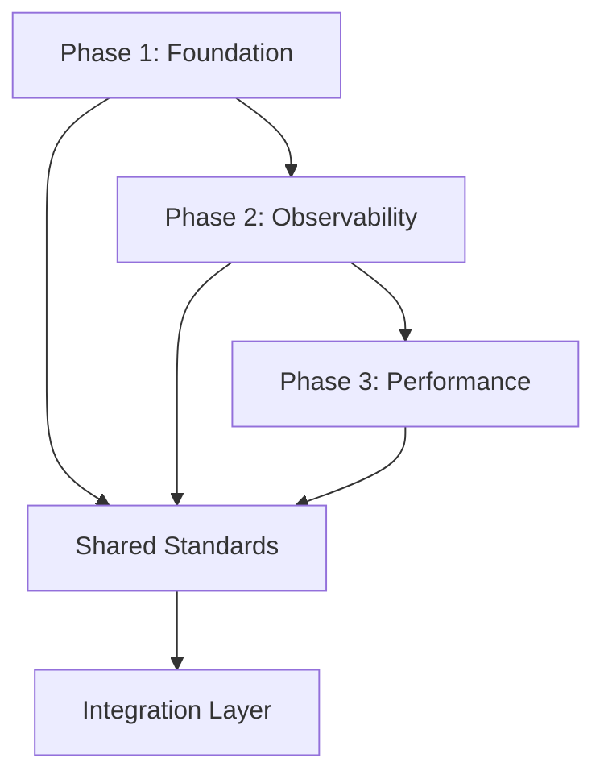

# RustForge Framework - Technische Architektur-Roadmap

**Senior Software Architect:** Technical Lead
**Version:** 1.0.0
**Datum:** 2025-11-03
**Status:** Implementation Ready

---

## Executive Summary

Diese Architektur-Roadmap definiert die koordinierte Implementierung von kritischen Verbesserungen im RustForge Framework. Drei spezialisierte Teams arbeiten parallel an Foundation, Observability und Performance-Optimierungen, mit klaren Integration Points und Quality Gates.

---

## 1. TECHNISCHE ARCHITEKTUR-ÜBERSICHT

### 1.1 Framework Architecture Layers

```
┌─────────────────────────────────────────────────────────────────┐
│                    Application Layer (Commands)                  │
├─────────────────────────────────────────────────────────────────┤
│                    Service Layer (Business Logic)                │
├─────────────────────────────────────────────────────────────────┤
│               Infrastructure Layer (Ports & Adapters)            │
├─────────────────────────────────────────────────────────────────┤
│                      Core Domain (Contracts)                     │
└─────────────────────────────────────────────────────────────────┘
```

### 1.2 Dependency Flow



### 1.3 Team Structure & Responsibilities

| Team | Focus Area | Key Deliverables |
|------|------------|------------------|
| Team 1 | Critical Fixes | Compilation, Error Handling, Tracing |
| Team 2 | Observability | OpenTelemetry, Metrics, Monitoring |
| Team 3 | Performance | Clone Reduction, Pooling, Optimization |

---

## 2. GEMEINSAME STANDARDS & PATTERNS

### 2.1 Unified Error Handling Pattern

```rust
// crates/foundry-core/src/error.rs
use std::fmt;
use thiserror::Error;

/// Base trait for all framework errors
pub trait FrameworkError: std::error::Error + Send + Sync + 'static {
    /// Unique error code for identification
    fn error_code(&self) -> &str;

    /// Indicates if the operation can be retried
    fn is_retryable(&self) -> bool {
        false
    }

    /// Error severity level
    fn severity(&self) -> ErrorSeverity {
        ErrorSeverity::Error
    }

    /// Structured context for observability
    fn context(&self) -> ErrorContext {
        ErrorContext::default()
    }
}

#[derive(Debug, Clone)]
pub enum ErrorSeverity {
    Critical,  // System failure, immediate action required
    Error,     // Operation failed, but system stable
    Warning,   // Degraded operation
    Info,      // Informational
}

#[derive(Debug, Default)]
pub struct ErrorContext {
    pub trace_id: Option<String>,
    pub span_id: Option<String>,
    pub user_id: Option<String>,
    pub tenant_id: Option<String>,
    pub metadata: std::collections::HashMap<String, serde_json::Value>,
}

/// Standardized error types for each domain
#[derive(Error, Debug)]
pub enum DomainError {
    #[error("Database error: {message}")]
    Database {
        message: String,
        #[source]
        source: Option<Box<dyn std::error::Error + Send + Sync>>,
        retry_after: Option<std::time::Duration>,
    },

    #[error("Validation error: {field}: {message}")]
    Validation {
        field: String,
        message: String,
        code: String,
    },

    #[error("Resource not found: {resource_type}#{resource_id}")]
    NotFound {
        resource_type: String,
        resource_id: String,
    },

    #[error("Operation timeout after {duration:?}")]
    Timeout {
        operation: String,
        duration: std::time::Duration,
    },
}

impl FrameworkError for DomainError {
    fn error_code(&self) -> &str {
        match self {
            Self::Database { .. } => "ERR_DB",
            Self::Validation { .. } => "ERR_VALIDATION",
            Self::NotFound { .. } => "ERR_NOT_FOUND",
            Self::Timeout { .. } => "ERR_TIMEOUT",
        }
    }

    fn is_retryable(&self) -> bool {
        matches!(self, Self::Database { retry_after: Some(_), .. } | Self::Timeout { .. })
    }
}
```

### 2.2 Observability Interface

```rust
// crates/foundry-observability/src/traits.rs
use async_trait::async_trait;

#[async_trait]
pub trait Observable: Send + Sync {
    /// Start a new span for tracing
    async fn span(&self, name: &str) -> Span;

    /// Record a metric
    async fn record_metric(&self, metric: Metric);

    /// Log an event
    async fn log_event(&self, event: Event);
}

pub struct Span {
    pub trace_id: String,
    pub span_id: String,
    pub parent_id: Option<String>,
    pub operation: String,
    pub start_time: std::time::Instant,
    pub attributes: std::collections::HashMap<String, String>,
}

pub enum Metric {
    Counter { name: String, value: u64, labels: Labels },
    Gauge { name: String, value: f64, labels: Labels },
    Histogram { name: String, value: f64, labels: Labels },
}

pub type Labels = std::collections::HashMap<String, String>;

pub struct Event {
    pub level: tracing::Level,
    pub message: String,
    pub fields: std::collections::HashMap<String, serde_json::Value>,
}
```

### 2.3 Resource Management Pattern

```rust
// crates/foundry-core/src/resources.rs
use std::sync::Arc;
use parking_lot::RwLock;

/// Zero-copy resource wrapper
#[derive(Clone)]
pub struct Resource<T> {
    inner: Arc<RwLock<T>>,
    metadata: Arc<ResourceMetadata>,
}

pub struct ResourceMetadata {
    pub created_at: std::time::Instant,
    pub last_accessed: RwLock<std::time::Instant>,
    pub access_count: std::sync::atomic::AtomicU64,
}

impl<T> Resource<T> {
    pub fn new(value: T) -> Self {
        Self {
            inner: Arc::new(RwLock::new(value)),
            metadata: Arc::new(ResourceMetadata {
                created_at: std::time::Instant::now(),
                last_accessed: RwLock::new(std::time::Instant::now()),
                access_count: std::sync::atomic::AtomicU64::new(0),
            }),
        }
    }

    pub fn read(&self) -> impl std::ops::Deref<Target = T> + '_ {
        self.metadata.access_count.fetch_add(1, std::sync::atomic::Ordering::Relaxed);
        *self.metadata.last_accessed.write() = std::time::Instant::now();
        self.inner.read()
    }

    pub fn write(&self) -> impl std::ops::DerefMut<Target = T> + '_ {
        self.metadata.access_count.fetch_add(1, std::sync::atomic::Ordering::Relaxed);
        *self.metadata.last_accessed.write() = std::time::Instant::now();
        self.inner.write()
    }
}
```

---

## 3. DEPENDENCY GRAPH & INTEGRATION POINTS

### 3.1 Phase Dependencies

```rust
// build.rs - Build-time validation of dependencies
fn validate_dependencies() {
    // Phase 1 MUST compile before Phase 2
    assert_dependency!("foundry-core" -> "foundry-observability");
    assert_dependency!("foundry-error" -> "foundry-observability");

    // Phase 2 MUST be complete before Phase 3
    assert_dependency!("foundry-observability" -> "foundry-performance");
    assert_dependency!("foundry-metrics" -> "foundry-performance");

    // Shared dependencies
    assert_dependency!("foundry-core" -> ALL_PHASES);
}
```

### 3.2 Integration Contract

```rust
// crates/foundry-core/src/integration.rs
pub trait IntegrationPoint: Send + Sync {
    type Input;
    type Output;
    type Error: FrameworkError;

    fn validate_input(&self, input: &Self::Input) -> Result<(), Self::Error>;
    fn transform(&self, input: Self::Input) -> Result<Self::Output, Self::Error>;
    fn validate_output(&self, output: &Self::Output) -> Result<(), Self::Error>;
}

/// Example: Team 1 -> Team 2 Integration
pub struct ErrorToObservability;

impl IntegrationPoint for ErrorToObservability {
    type Input = DomainError;
    type Output = ObservableError;
    type Error = IntegrationError;

    fn transform(&self, error: DomainError) -> Result<ObservableError, IntegrationError> {
        Ok(ObservableError {
            base_error: error,
            trace_context: TraceContext::current(),
            metrics: vec![
                Metric::Counter {
                    name: "errors_total".into(),
                    value: 1,
                    labels: hashmap! {
                        "code" => error.error_code().to_string(),
                    },
                },
            ],
        })
    }
}
```

---

## 4. QUALITY GATES & TESTING STRATEGY

### 4.1 Quality Metrics

```toml
# .quality-gates.toml
[coverage]
minimum = 80
exclude = ["tests/*", "benches/*", "examples/*"]

[performance]
max_clone_calls_per_request = 5
max_memory_per_request_mb = 50
max_latency_p99_ms = 100

[complexity]
max_cyclomatic = 10
max_cognitive = 15

[dependencies]
max_direct = 20
max_total = 100
banned = ["tokio::time::sleep"] # Use framework abstractions
```

### 4.2 Integration Test Framework

```rust
// tests/integration/framework.rs
use foundry_testing::prelude::*;

#[framework_test]
async fn test_error_observability_integration() {
    // Given: Error handling system (Team 1)
    let error_system = ErrorSystem::new();

    // And: Observability system (Team 2)
    let observability = ObservabilitySystem::new();

    // When: An error occurs
    let error = DomainError::Database {
        message: "Connection timeout".into(),
        source: None,
        retry_after: Some(Duration::from_secs(5)),
    };

    // Then: Error is properly observed
    let observable = observability.observe_error(error).await?;

    assert_eq!(observable.trace_id(), Some("..."));
    assert_eq!(observable.metrics().len(), 2);
    assert!(observable.is_retryable());
}

#[benchmark_test]
async fn bench_command_execution() {
    let ctx = create_minimal_context(); // Team 3: Optimized context

    benchmark_group("command_execution", |b| {
        b.iter(|| async {
            let cmd = TestCommand::new();
            cmd.execute(ctx.clone()).await
        });
    });

    assert_performance_within_limits!();
}
```

### 4.3 Continuous Validation

```yaml
# .github/workflows/quality-gates.yml
name: Quality Gates
on: [push, pull_request]

jobs:
  validate:
    runs-on: ubuntu-latest
    steps:
      - name: Check Phase 1 Compilation
        run: cargo check -p foundry-core -p foundry-error

      - name: Run Unit Tests with Coverage
        run: cargo tarpaulin --out Xml --coverage 80

      - name: Performance Benchmarks
        run: cargo bench --bench framework -- --save-baseline PR-${{ github.event.number }}

      - name: Complexity Analysis
        run: cargo complexity --max-cyclomatic 10

      - name: Memory Profiling
        run: cargo valgrind --leak-check=full
```

---

## 5. KOORDINATIONSPLAN FÜR TEAMS

### 5.1 Sprint Planning

```markdown
## Sprint 1 (Weeks 1-2): Foundation Setup
- Team 1: Core error types, compilation fixes
- Team 2: OpenTelemetry setup, basic spans
- Team 3: Profiling infrastructure, benchmarks

## Sprint 2 (Weeks 3-4): Integration
- Team 1: Error context propagation
- Team 2: Metrics collection, dashboards
- Team 3: First optimization pass (clones)

## Sprint 3 (Weeks 5-6): Optimization
- Team 1: Error recovery strategies
- Team 2: Distributed tracing
- Team 3: Connection pooling, caching

## Sprint 4 (Week 7): Integration & Testing
- All Teams: Integration testing
- All Teams: Performance validation
- All Teams: Documentation
```

### 5.2 Communication Protocol

```rust
// Shared communication channel for teams
pub enum TeamMessage {
    // Team 1 -> Team 2
    ErrorSystemReady { version: String },

    // Team 2 -> Team 3
    MetricsAvailable { endpoints: Vec<String> },

    // Team 3 -> All
    PerformanceBaseline { report: BenchmarkReport },

    // Coordination
    IntegrationPoint {
        from_team: u8,
        to_team: u8,
        contract: String
    },
}
```

---

## 6. TECHNICAL DEBT PRIORITIZATION

### 6.1 Critical Issues (Priority 1)

```rust
// ISSUE: Clone overhead (490 calls detected)
// SOLUTION: Implement Arc-based sharing
impl CommandContext {
    // BEFORE: 14 fields, all cloned
    pub fn clone(&self) -> Self { /* ... */ }

    // AFTER: Single Arc clone
    pub fn clone(&self) -> Self {
        Self {
            inner: self.inner.clone(), // Arc<CommandContextInner>
        }
    }
}

// ISSUE: God Object (14 fields)
// SOLUTION: Split into focused components
pub struct CommandContext {
    // BEFORE: 14 fields
    // AFTER: 4 focused components
    execution: Arc<ExecutionContext>,
    services: Arc<ServiceContainer>,
    observability: Arc<ObservabilityContext>,
    resources: Arc<ResourceManager>,
}
```

### 6.2 Performance Issues (Priority 2)

```rust
// ISSUE: Type erasure in service container
// SOLUTION: Generic service registry with compile-time safety
pub struct ServiceContainer {
    // BEFORE: HashMap<TypeId, Box<dyn Any>>
    // AFTER: Type-safe registry
    registry: ServiceRegistry,
}

pub struct ServiceRegistry {
    // Type-safe service storage
    services: Arc<RwLock<anymap::AnyMap>>,
}

impl ServiceRegistry {
    pub fn register<T: Service>(&self, service: T) {
        self.services.write().insert(service);
    }

    pub fn resolve<T: Service>(&self) -> Option<T> {
        self.services.read().get::<T>().cloned()
    }
}
```

### 6.3 Maintenance Issues (Priority 3)

```rust
// ISSUE: Scattered error handling
// SOLUTION: Centralized error pipeline
pub struct ErrorPipeline {
    handlers: Vec<Box<dyn ErrorHandler>>,
    fallback: Box<dyn ErrorHandler>,
}

impl ErrorPipeline {
    pub async fn handle(&self, error: Box<dyn FrameworkError>) -> Result<Recovery, FatalError> {
        for handler in &self.handlers {
            if let Some(recovery) = handler.try_handle(&error).await? {
                return Ok(recovery);
            }
        }
        self.fallback.handle(error).await
    }
}
```

---

## 7. MIGRATION STRATEGY

### 7.1 Backward Compatibility Layer

```rust
// crates/foundry-compat/src/lib.rs
/// Compatibility layer for smooth migration
pub mod compat {
    use crate::new::{CommandContext as NewContext};
    use crate::old::{CommandContext as OldContext};

    /// Adapter for old command implementations
    pub struct CommandAdapter<C: OldCommand> {
        inner: C,
    }

    impl<C: OldCommand> NewCommand for CommandAdapter<C> {
        async fn execute(&self, ctx: NewContext) -> Result<CommandResult, FrameworkError> {
            // Convert new context to old format
            let old_ctx = ctx.into_legacy();

            // Execute with old interface
            let old_result = self.inner.execute(old_ctx).await?;

            // Convert result to new format
            Ok(old_result.into_modern())
        }
    }
}
```

### 7.2 Feature Flags

```rust
// crates/foundry-core/src/features.rs
pub struct FeatureFlags {
    flags: Arc<RwLock<HashMap<String, bool>>>,
}

impl FeatureFlags {
    pub fn is_enabled(&self, feature: &str) -> bool {
        self.flags.read().get(feature).copied().unwrap_or(false)
    }

    pub fn enable(&self, feature: &str) {
        self.flags.write().insert(feature.to_string(), true);
    }
}

// Usage in code
pub async fn execute_command(ctx: CommandContext) -> Result<CommandResult, FrameworkError> {
    if ctx.features().is_enabled("new_error_handling") {
        // New implementation
        execute_with_new_error_handling(ctx).await
    } else {
        // Legacy implementation
        execute_legacy(ctx).await
    }
}
```

### 7.3 Deprecation Strategy

```rust
/// Mark deprecated items with clear migration path
#[deprecated(
    since = "0.3.0",
    note = "Use `CommandContext::new()` instead. Will be removed in 0.4.0"
)]
pub fn create_context() -> CommandContext {
    CommandContext::new()
}

/// Provide migration guide
pub mod migration {
    //! # Migration Guide v0.2 -> v0.3
    //!
    //! ## CommandContext Changes
    //! ```rust
    //! // OLD
    //! let ctx = create_context();
    //! ctx.args.clone();
    //!
    //! // NEW
    //! let ctx = CommandContext::new();
    //! ctx.args(); // Returns &[String], no clone
    //! ```
}
```

---

## 8. IMPLEMENTATION TIMELINE

### Phase 1: Foundation (Weeks 1-2)
**Team 1: Critical Fixes**

```rust
// Week 1: Error System
- [ ] Implement FrameworkError trait
- [ ] Create error types hierarchy
- [ ] Add error context propagation
- [ ] Fix compilation issues

// Week 2: Integration
- [ ] Error -> Observability bridge
- [ ] Testing framework
- [ ] Documentation
```

### Phase 2: Observability (Weeks 3-4)
**Team 2: Monitoring & Metrics**

```rust
// Week 3: OpenTelemetry
- [ ] Tracing setup
- [ ] Metrics collection
- [ ] Log correlation
- [ ] Span propagation

// Week 4: Dashboards
- [ ] Grafana integration
- [ ] Prometheus metrics
- [ ] Jaeger tracing
- [ ] Alert rules
```

### Phase 3: Performance (Weeks 5-6)
**Team 3: Optimization**

```rust
// Week 5: Clone Reduction
- [ ] Arc-based CommandContext
- [ ] Resource pooling
- [ ] String interning
- [ ] Benchmark suite

// Week 6: Advanced Optimization
- [ ] Connection pooling
- [ ] Query caching
- [ ] Lazy evaluation
- [ ] Memory profiling
```

---

## 9. SUCCESS METRICS

### 9.1 Performance KPIs

| Metric | Current | Target | Measurement |
|--------|---------|--------|-------------|
| Clone calls/request | 490 | < 10 | Profiler |
| P99 latency | 250ms | < 100ms | Prometheus |
| Memory/request | 100MB | < 50MB | Valgrind |
| Startup time | 500ms | < 200ms | Benchmark |

### 9.2 Quality KPIs

| Metric | Current | Target | Measurement |
|--------|---------|--------|-------------|
| Test coverage | 65% | > 80% | Tarpaulin |
| Error recovery rate | 40% | > 90% | Metrics |
| MTTR | 30min | < 10min | Observability |
| Code complexity | 15 | < 10 | Clippy |

### 9.3 Team KPIs

| Metric | Target | Measurement |
|--------|--------|-------------|
| Sprint velocity | 40 points | JIRA |
| Integration test pass rate | > 95% | CI/CD |
| Documentation coverage | 100% | rustdoc |
| Cross-team PRs reviewed | < 24h | GitHub |

---

## 10. RISK MITIGATION

### 10.1 Technical Risks

| Risk | Impact | Probability | Mitigation |
|------|--------|-------------|------------|
| Breaking changes | High | Medium | Feature flags, compatibility layer |
| Performance regression | High | Low | Continuous benchmarking |
| Integration failures | Medium | Medium | Contract testing |
| Memory leaks | High | Low | Valgrind in CI |

### 10.2 Coordination Risks

| Risk | Impact | Probability | Mitigation |
|------|--------|-------------|------------|
| Team dependencies | Medium | High | Clear interfaces, mocks |
| Communication gaps | Medium | Medium | Daily standups, shared Slack |
| Scope creep | Medium | Medium | Sprint planning, backlog grooming |
| Knowledge silos | Low | Medium | Pair programming, documentation |

---

## APPENDIX A: Code Examples

### A.1 Optimized CommandContext

```rust
// crates/foundry-core/src/context.rs
use std::sync::Arc;
use parking_lot::RwLock;

/// Optimized CommandContext with minimal cloning
#[derive(Clone)]
pub struct CommandContext {
    inner: Arc<ContextInner>,
}

struct ContextInner {
    execution: ExecutionContext,
    services: ServiceContainer,
    observability: ObservabilityContext,
    resources: ResourceManager,
}

impl CommandContext {
    pub fn new(
        args: Vec<String>,
        config: serde_json::Value,
    ) -> Self {
        Self {
            inner: Arc::new(ContextInner {
                execution: ExecutionContext::new(args),
                services: ServiceContainer::default(),
                observability: ObservabilityContext::default(),
                resources: ResourceManager::new(config),
            }),
        }
    }

    // Zero-copy accessors
    pub fn args(&self) -> &[String] {
        &self.inner.execution.args
    }

    pub fn service<T: Service>(&self) -> Option<Arc<T>> {
        self.inner.services.resolve::<T>()
    }

    pub fn span(&self, name: &str) -> Span {
        self.inner.observability.span(name)
    }
}
```

### A.2 Connection Pool Implementation

```rust
// crates/foundry-performance/src/pool.rs
use deadpool::managed::{Manager, Pool};

pub struct ConnectionPool {
    pool: Pool<DbManager>,
}

struct DbManager {
    config: DbConfig,
}

#[async_trait]
impl Manager for DbManager {
    type Type = DbConnection;
    type Error = DbError;

    async fn create(&self) -> Result<DbConnection, DbError> {
        DbConnection::connect(&self.config).await
    }

    async fn recycle(&self, conn: &mut DbConnection) -> Result<(), DbError> {
        conn.ping().await
    }
}

impl ConnectionPool {
    pub fn new(config: DbConfig, size: usize) -> Self {
        let mgr = DbManager { config };
        let pool = Pool::builder(mgr)
            .max_size(size)
            .build()
            .expect("Failed to create pool");

        Self { pool }
    }

    pub async fn get(&self) -> Result<Object<DbManager>, DbError> {
        self.pool.get().await.map_err(|e| DbError::Pool(e.to_string()))
    }
}
```

### A.3 Unified Observability

```rust
// crates/foundry-observability/src/unified.rs
use opentelemetry::{global, sdk};
use tracing_subscriber::prelude::*;

pub struct UnifiedObservability {
    tracer: Arc<dyn opentelemetry::trace::Tracer>,
    meter: Arc<dyn opentelemetry::metrics::Meter>,
}

impl UnifiedObservability {
    pub fn init() -> Result<Self, ObservabilityError> {
        // Setup tracing
        let tracer = global::tracer("foundry");

        // Setup metrics
        let meter = global::meter("foundry");

        // Setup logging with trace correlation
        tracing_subscriber::registry()
            .with(tracing_subscriber::fmt::layer())
            .with(tracing_opentelemetry::layer())
            .init();

        Ok(Self {
            tracer: Arc::new(tracer),
            meter: Arc::new(meter),
        })
    }

    pub fn trace<F, R>(&self, name: &str, f: F) -> R
    where
        F: FnOnce(&Context) -> R,
    {
        let span = self.tracer.start(name);
        let cx = Context::current_with_span(span);
        f(&cx)
    }

    pub fn record_metric(&self, name: &str, value: f64, labels: &[(&str, &str)]) {
        let recorder = self.meter.f64_histogram(name).init();
        let labels: Vec<KeyValue> = labels
            .iter()
            .map(|(k, v)| KeyValue::new(*k, *v))
            .collect();
        recorder.record(value, &labels);
    }
}
```

---

## APPENDIX B: Testing Guidelines

### B.1 Unit Test Template

```rust
#[cfg(test)]
mod tests {
    use super::*;
    use foundry_testing::prelude::*;

    #[tokio::test]
    async fn test_error_propagation() {
        // Arrange
        let error = DomainError::NotFound {
            resource_type: "User".into(),
            resource_id: "123".into(),
        };

        // Act
        let result = handle_error(error).await;

        // Assert
        assert!(result.is_err());
        assert_eq!(result.unwrap_err().error_code(), "ERR_NOT_FOUND");
    }

    #[tokio::test]
    async fn test_performance_threshold() {
        let start = Instant::now();

        // Execute operation
        execute_command(create_test_context()).await.unwrap();

        let elapsed = start.elapsed();
        assert!(elapsed < Duration::from_millis(100),
                "Operation took {:?}, expected < 100ms", elapsed);
    }
}
```

### B.2 Integration Test Template

```rust
#[cfg(test)]
mod integration {
    use super::*;
    use foundry_testing::integration::*;

    #[integration_test]
    async fn test_end_to_end_command_flow() {
        // Setup test environment
        let env = TestEnvironment::new().await;

        // Create command with all systems
        let ctx = env.create_context()
            .with_tracing()
            .with_metrics()
            .with_error_handling()
            .build();

        // Execute command
        let result = TestCommand::new()
            .execute(ctx)
            .await
            .expect("Command should succeed");

        // Verify observability
        assert!(env.has_trace("test_command"));
        assert!(env.has_metric("command_duration"));

        // Verify no memory leaks
        env.assert_no_leaks();
    }
}
```

---

## CONTACT & COORDINATION

**Architecture Lead:** Senior Software Architect
**Team 1 Lead:** Critical Systems Engineer
**Team 2 Lead:** Observability Engineer
**Team 3 Lead:** Performance Engineer

**Communication Channels:**
- Slack: #rustforge-architecture
- Daily Standup: 09:00 CET
- Weekly Architecture Review: Friday 14:00 CET

---

**Document Version:** 1.0.0
**Last Updated:** 2025-11-03
**Next Review:** 2025-11-10

---

## END OF DOCUMENT

*This architecture roadmap is a living document and will be updated as the implementation progresses.*